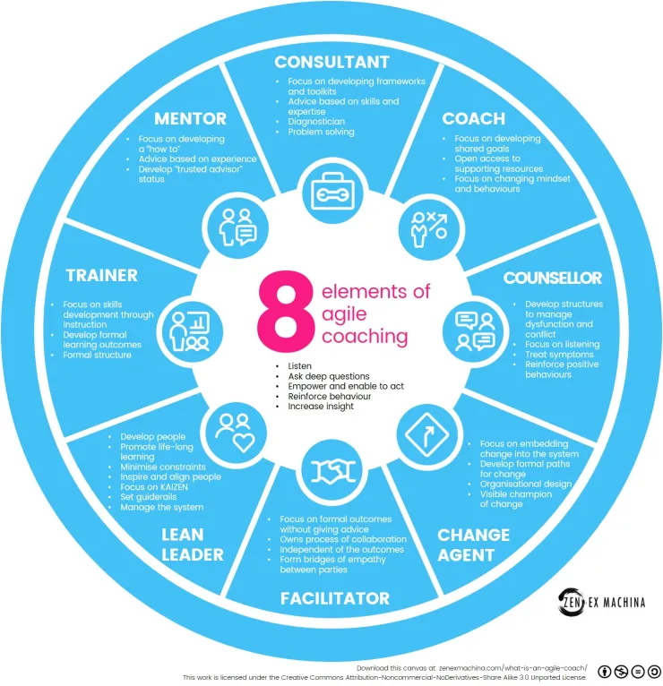
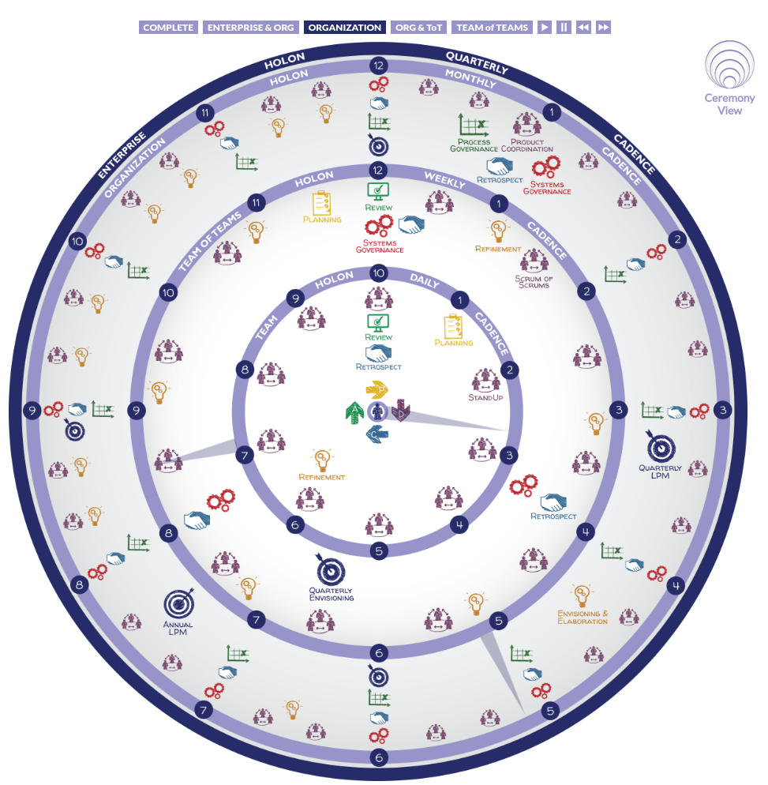
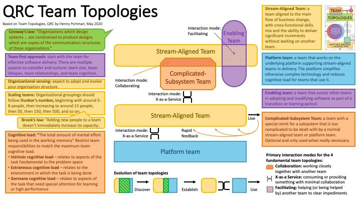
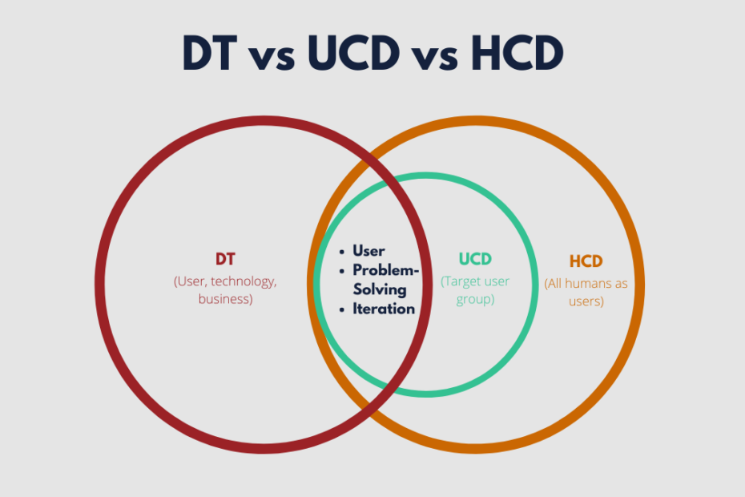
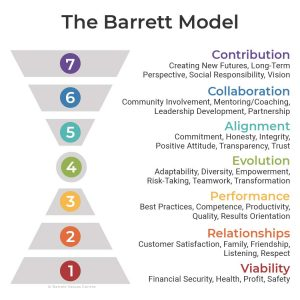
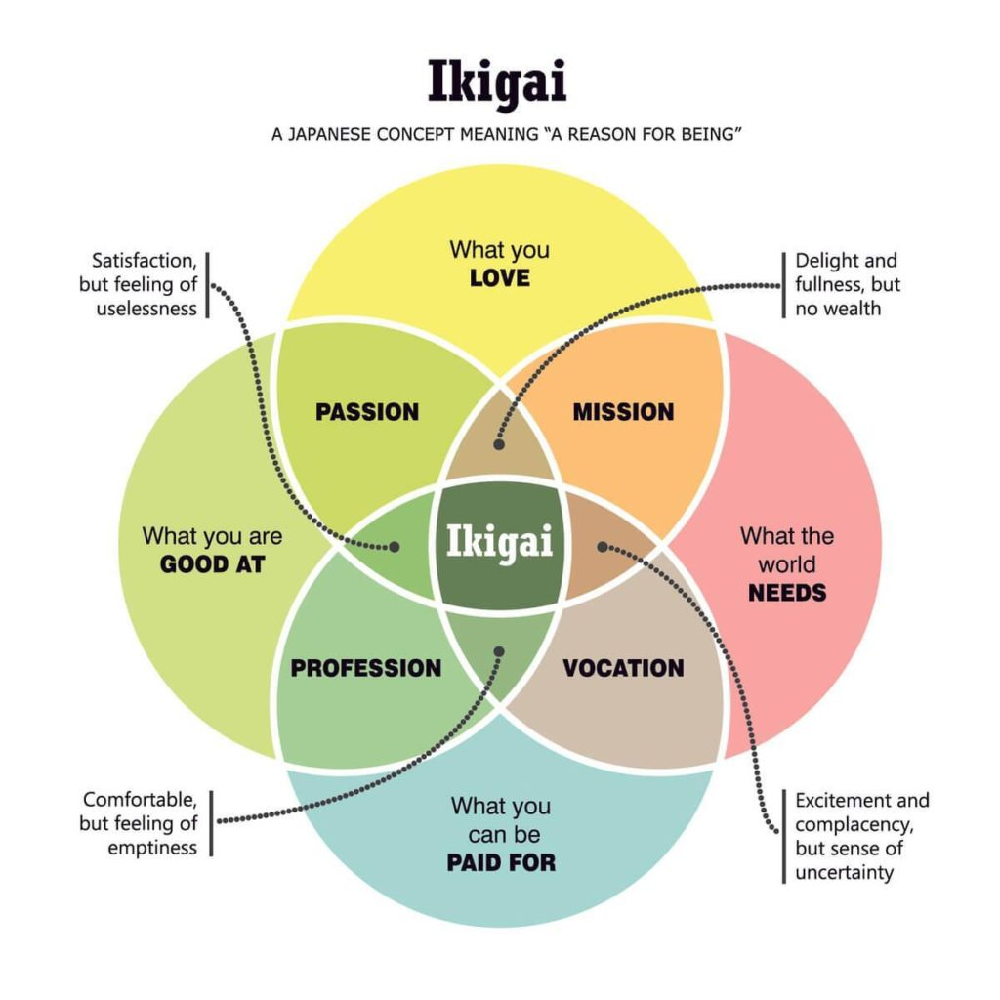
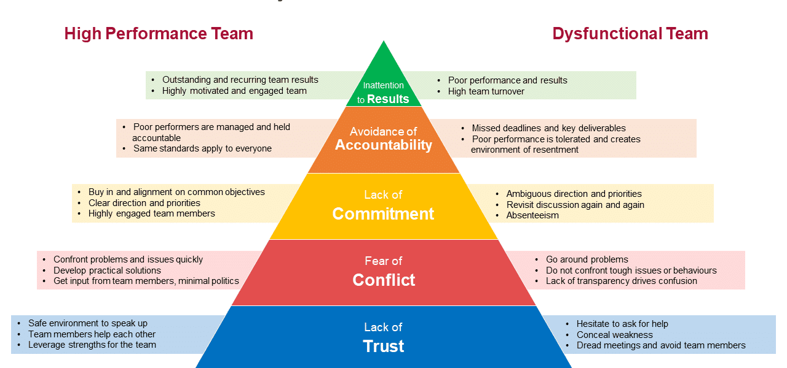

# Knowledge Base of Jaremy Hatler

This is my personal knowledge base, and will be a perpetual work in progress.
This file is generated from the `data.yml` file using the `templates/README.md.j2`
template. The images are stored in the `imgs` directory, and the source links are
included when available. I don't claim any of this as my own work unless explicitly
stated.

**Planned Enhancements:**

- [ ] Create standardized information for each entry:
    - [X] Title
    - [X] Image
    - [X] Source
    - [ ] Keywords
    - [ ] Summary (Purpose and key concepts)
    - [ ] Target Audience
    - [ ] Indications & Contraindications
    - [ ] Pros & Cons
    - [ ] Related Concepts
    - [ ] Related Entries
- [ ] Create project to track:
  - [ ] Outstanding entries I want to add from my notes and other sources.
  - [ ] Compliance with the above standardization.
- [ ] GitHub.io site.
- [ ] GitHub Actions workflow to update the README.md and routinely check for
  broken links (automatically create issues).
- [ ] Separate sections into different files.
- [ ] Add a table of contents.

## Software Development Lifecycle

Extreme Programming

Source: [http://www.extremeprogramming.org/](http://www.extremeprogramming.org/)

Waterfall Model

Source: [https://en.wikipedia.org/wiki/Waterfall_model](https://en.wikipedia.org/wiki/Waterfall_model)

W Model

Source: [https://www.agileconnection.com/sites/default/files/article/file/2014/The%20W%20Model%20-%20Strengthening%20the%20Bond%20Between%20Development%20and%20Test.pdf](https://www.agileconnection.com/sites/default/files/article/file/2014/The%20W%20Model%20-%20Strengthening%20the%20Bond%20Between%20Development%20and%20Test.pdf)

V Model

Source: [https://en.wikipedia.org/wiki/V-model](https://en.wikipedia.org/wiki/V-model)

Spiral Model

Source: [https://en.wikipedia.org/wiki/Spiral_model](https://en.wikipedia.org/wiki/Spiral_model)

## Agile Frameworks and tools

Design Thinking + Lean Startup + Agile

Source: [https://www.linkedin.com/pulse/design-thinking-lean-startup-agile-pradeep-patel/](https://www.linkedin.com/pulse/design-thinking-lean-startup-agile-pradeep-patel/)

Modern Agile

Source: [https://modernagile.org/](https://modernagile.org/)

Heart of Agile

Source: [https://heartofagile.com/](https://heartofagile.com/)

LeSS Framework

Source: [https://less.works/less/framework/introduction](https://less.works/less/framework/introduction)

Openspace Agility

Source: [https://openspaceagility.com/what-is-ost/](https://openspaceagility.com/what-is-ost/)

Kanban

Source: [https://en.wikipedia.org/wiki/Kanban_%28development%29](https://en.wikipedia.org/wiki/Kanban_%28development%29)

Integral Agile Transformation Framework

Source: [https://www.trans4mation.coach/trans4mation-approach/](https://www.trans4mation.coach/trans4mation-approach/)

Kanban Maturity Model

Source: [https://www.kanbanmaturitymodel.com/](https://www.kanbanmaturitymodel.com/)

Agile Coaching Skills

Source: [https://appliedframeworks.com/blog/what-skills-does-your-agile-coach-need](https://appliedframeworks.com/blog/what-skills-does-your-agile-coach-need)

Disciplined Agile

Source: [https://kendis.io/disciplined-agile/disciplined-agile-delivery-dad/](https://kendis.io/disciplined-agile/disciplined-agile-delivery-dad/)

8 Elements of Agile Coaching

Source: [https://zenexmachina.com/what-is-an-agile-coach/](https://zenexmachina.com/what-is-an-agile-coach/)

Agile Coaching in a Nutshell

Integral Agile

Source: [https://integralagile.com/holons/cadence](https://integralagile.com/holons/cadence)

Nexus Framework

Source: [https://www.scrum.org/resources/scaling-scrum](https://www.scrum.org/resources/scaling-scrum)

## Project Management

Project Management Body of Knowledge

Source: [https://en.wikibooks.org/wiki/Project_Management/PMBOK](https://en.wikibooks.org/wiki/Project_Management/PMBOK)

PRINCE2

Source: [https://en.wikipedia.org/wiki/PRINCE2](https://en.wikipedia.org/wiki/PRINCE2)

Risk Assessment Matrix

Source: [https://tms-outsource.com/blog/posts/risk-assessment-matrix/](https://tms-outsource.com/blog/posts/risk-assessment-matrix/)

## Process Management

Plan Do Check Act (PDCA)

Source: [https://businessmap.io/lean-management/improvement/what-is-pdca-cycle](https://businessmap.io/lean-management/improvement/what-is-pdca-cycle)

5S Levels of Achievement

Source: [https://leanconstruction.org/lean-topics/5s/](https://leanconstruction.org/lean-topics/5s/)

Team Topologies

Source: [https://p4dev.hardscrum.com/en/team-topologies-in-p4/](https://p4dev.hardscrum.com/en/team-topologies-in-p4/)

Tools of the Learning Organization

Source: [https://en.wikipedia.org/wiki/Learning_organization](https://en.wikipedia.org/wiki/Learning_organization)

QRC Team Topologies

Source: [https://hennyportman.wordpress.com/2020/05/25/review-team-topologies/](https://hennyportman.wordpress.com/2020/05/25/review-team-topologies/)

What is Hoshin Kanri?

Source: [https://businessmap.io/lean-management/hoshin-kanri/what-is-hoshin-kanri](https://businessmap.io/lean-management/hoshin-kanri/what-is-hoshin-kanri)

Hoshin Kanri Strategic Deployment Matrix

Source: [https://ideas.darden.virginia.edu/hoshin-kanri-management-tool](https://ideas.darden.virginia.edu/hoshin-kanri-management-tool)

Process Communication Model

Source: [https://processcommunicationmodel.com/](https://processcommunicationmodel.com/)

## Lean Principles

The Toyota Way Principles of Lean Management

Source: [https://www.agilecoach.net/wp-content/uploads/2009/05/toyota-way-handout.pdf](https://www.agilecoach.net/wp-content/uploads/2009/05/toyota-way-handout.pdf)

5 Key Lean Principles for Engineers

Source: [https://www.asme.org/topics-resources/content/5-lean-principles-every-should-know](https://www.asme.org/topics-resources/content/5-lean-principles-every-should-know)

7 Wastes of Lean

Source: [https://businessmap.io/lean-management/value-waste/7-wastes-of-lean](https://businessmap.io/lean-management/value-waste/7-wastes-of-lean)

Lean Management Principles

Source: [https://businessmap.io/lean-management/implementing-lean-principles](https://businessmap.io/lean-management/implementing-lean-principles)

## Design Methodologies

Design Thinking

Source: [https://www.programstrategyhq.com/post/design-thinking-process](https://www.programstrategyhq.com/post/design-thinking-process)

Human Centered Design

Source: [https://www.davidhodder.com/humancentreddesign/](https://www.davidhodder.com/humancentreddesign/)

Design Thinking vs User Centered Design vs Human Centered Design

Human-Centered Design vs. Design-Thinking

Source: [https://blog.movingworlds.org/human-centered-design-vs-design-thinking-how-theyre-different-and-how-to-use-them-together-to-create-lasting-change/](https://blog.movingworlds.org/human-centered-design-vs-design-thinking-how-theyre-different-and-how-to-use-them-together-to-create-lasting-change/)

Double Diamond Design Thinking Process

Source: [https://www.designorate.com/the-double-diamond-design-thinking-process-and-how-to-use-it/](https://www.designorate.com/the-double-diamond-design-thinking-process-and-how-to-use-it/)

New Double Diamond Design Thinking Process

Source: [https://medium.com/design-leadership-notebook/the-new-double-diamond-design-process-7c8f12d7945e](https://medium.com/design-leadership-notebook/the-new-double-diamond-design-process-7c8f12d7945e)

Design Sprints

Source: [https://uxplanet.org/whats-a-design-sprint-and-why-is-it-important-f7b826651e09](https://uxplanet.org/whats-a-design-sprint-and-why-is-it-important-f7b826651e09)

## Innovation Management

Managing Your Innovation Portfolio

Source: [https://hbr.org/2012/05/managing-your-innovation-portfolio](https://hbr.org/2012/05/managing-your-innovation-portfolio)

Jobs-To-Be-Done Canvas

Source: [https://jobs-to-be-done.com/the-jobs-to-be-done-canvas-f3f784ad6270](https://jobs-to-be-done.com/the-jobs-to-be-done-canvas-f3f784ad6270)

Value Proposition Canvas

Source: [https://www.groupmap.com/portfolio/value-proposition](https://www.groupmap.com/portfolio/value-proposition)

Kano Model

Source: [https://www.microsoft.com/en-us/research/articles/lots-of-ideas-but-not-sure-how-to-prioritize-the-kano-model-can-help/](https://www.microsoft.com/en-us/research/articles/lots-of-ideas-but-not-sure-how-to-prioritize-the-kano-model-can-help/)

Three Horizons of Innovation and Culture Change

Source: [https://designforsustainability.medium.com/the-three-horizons-of-innovation-and-culture-change-d9681b0e0b0f](https://designforsustainability.medium.com/the-three-horizons-of-innovation-and-culture-change-d9681b0e0b0f)

Disruptive Innovation Model

Source: [https://hbr.org/2015/12/what-is-disruptive-innovation](https://hbr.org/2015/12/what-is-disruptive-innovation)

## Business Strategy and Performance

Business Model Canvas

Source: [https://en.wikipedia.org/wiki/Business_model_canvas](https://en.wikipedia.org/wiki/Business_model_canvas)

BCG Matrix

Source: [https://www.thepowermba.com/en/blog/bcg-matrix](https://www.thepowermba.com/en/blog/bcg-matrix)

The Golden Circle

Source: [https://www.smartinsights.com/digital-marketing-strategy/online-value-proposition/start-with-why-creating-a-value-proposition-with-the-golden-circle-model/](https://www.smartinsights.com/digital-marketing-strategy/online-value-proposition/start-with-why-creating-a-value-proposition-with-the-golden-circle-model/)

Inbound Methodology Lifecycle

Source: [https://medium.com/@leadsngin/what-is-the-inbound-methodology-lifecycle-a1489a641e4f](https://medium.com/@leadsngin/what-is-the-inbound-methodology-lifecycle-a1489a641e4f)

North Star Metric

Source: [https://cxl.com/blog/north-star-metric/](https://cxl.com/blog/north-star-metric/)

Finding a North Star Metric

Source: [https://growwithward.com/north-star-metric/](https://growwithward.com/north-star-metric/)

AARRR Framework

Source: [https://www.designwithvalue.com/aarrr-framework](https://www.designwithvalue.com/aarrr-framework)

North Star Statement Exercise

Source: [https://plan.io/blog/north-star-metrics/](https://plan.io/blog/north-star-metrics/)

Balanced Scorecard

Source: [https://hbr.org/1992/01/the-balanced-scorecard-measures-that-drive-performance-2](https://hbr.org/1992/01/the-balanced-scorecard-measures-that-drive-performance-2)

AAARRR Pirate Funnel

Source: [https://growwithward.com/aaarrr-pirate-funnel/](https://growwithward.com/aaarrr-pirate-funnel/)

AARRR Pirate Metrics for Startups

Source: [https://mcgaw.io/blog/aarrr-pirate-metrics-for-startups/#gs.l0xwgr](https://mcgaw.io/blog/aarrr-pirate-metrics-for-startups/#gs.l0xwgr)

Net Prompoter Score

Source: [https://www.checkmarket.com/blog/net-promoter-score/](https://www.checkmarket.com/blog/net-promoter-score/)

Customer Effort Scores

Source: [https://acxpa.com.au/glossary/customer-effort-score/](https://acxpa.com.au/glossary/customer-effort-score/)

## Leadership and Organizational Change

TEAL Model

Source: [https://www.iberdrola.com/talent/teal-organisations](https://www.iberdrola.com/talent/teal-organisations)

Leadership Styles

Source: [https://www.personio.com/hr-lexicon/six-goleman-leadership-styles/](https://www.personio.com/hr-lexicon/six-goleman-leadership-styles/)

Sociocracy

Source: [https://sociocracy30.org/the-details/why-sociocracy-3-0/](https://sociocracy30.org/the-details/why-sociocracy-3-0/)

The Barret Model

Source: [https://www.valuescentre.com/articles/theoretical-support-for-the-barrett-model](https://www.valuescentre.com/articles/theoretical-support-for-the-barrett-model)

Delegation Levels

Source: [https://www.linkedin.com/pulse/unclear-team-responsibilities-use-delegation-levels-jurgen-appelo/](https://www.linkedin.com/pulse/unclear-team-responsibilities-use-delegation-levels-jurgen-appelo/)

Management 3.0

Source: [https://management30.com/learn/](https://management30.com/learn/)

Situational Leadership

Source: [https://situational.com/situational-leadership/](https://situational.com/situational-leadership/)

Holocracy vs Hierarchy

Source: [https://businessmap.io/blog/agile-holacracy](https://businessmap.io/blog/agile-holacracy)

Kotter's 8 Step Model for Leading Change

Source: [https://www.linkedin.com/pulse/kotters-8-step-model-leading-change-big-opportunity-unlike-mishra/](https://www.linkedin.com/pulse/kotters-8-step-model-leading-change-big-opportunity-unlike-mishra/)

## Personal and Team Development

Celebration Grid

Source: [https://management30.com/practice/celebration-grids/](https://management30.com/practice/celebration-grids/)

Liberating Structures

Source: [https://www.liberatingstructures.com/ls-menu/](https://www.liberatingstructures.com/ls-menu/)

Thinking Hats

Source: [https://www.agile-moose.com/debonos-6-hats](https://www.agile-moose.com/debonos-6-hats)

Ikigai

Source: [https://management30.com/blog/redefining-purpose-with-ikigai/](https://management30.com/blog/redefining-purpose-with-ikigai/)

5 Disfunctions of Virtual Teams

Source: [https://tomorrowsleadership.nl/how-to-overcome-the-5-dysfunctions-of-virtual-teams/](https://tomorrowsleadership.nl/how-to-overcome-the-5-dysfunctions-of-virtual-teams/)

5 Characteristics of a High Performing Team

Source: [https://trackerproducts.com/evidence-management-leadership-series-the-five-dysfunctions-of-a-team/](https://trackerproducts.com/evidence-management-leadership-series-the-five-dysfunctions-of-a-team/)

Social Emotional Learning Assessment Framework

Source: [https://casel.org/state-resource-center/assessment-tools/](https://casel.org/state-resource-center/assessment-tools/)

Myers-Briggs Personality Types

Source: [https://en.wikipedia.org/wiki/Myers%E2%80%93Briggs_Type_Indicator](https://en.wikipedia.org/wiki/Myers%E2%80%93Briggs_Type_Indicator)

Double Loop Learning

Source: [https://www.selfleadership.com/blog/double-loop-learning-survive-thrive](https://www.selfleadership.com/blog/double-loop-learning-survive-thrive)

Emotional Intelligence Framework

Source: [https://positivepsychology.com/emotional-intelligence-frameworks/](https://positivepsychology.com/emotional-intelligence-frameworks/)

## Decision Making

Observe Orient Decide Act (OODA)

Source: [https://thedecisionlab.com/reference-guide/computer-science/the-ooda-loop](https://thedecisionlab.com/reference-guide/computer-science/the-ooda-loop)

Volatility Uncertainty Complexity Ambiguity (VUCA)

Source: [https://www.talkspirit.com/blog/how-vuca-affects-business](https://www.talkspirit.com/blog/how-vuca-affects-business)

Cynefin Framework

Source: [https://en.wikipedia.org/wiki/Cynefin_framework](https://en.wikipedia.org/wiki/Cynefin_framework)

